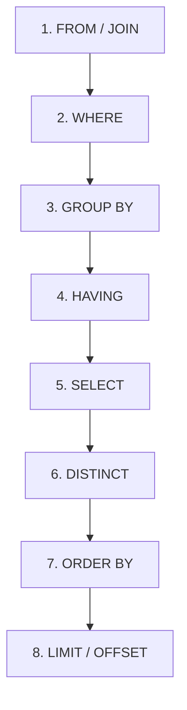

# 🗄️ The Ultimate SQL Query Pattern & Syntax Guide

This guide is structured to help you understand the core patterns of SQL. Mastering these patterns will allow you to solve almost any SQL query problem asked in SDE interviews.

---

## 🧭 1. Logical Execution Order of a SQL Query
When writing queries, remember that SQL does **not** execute from top to bottom. It runs in the following order:



*   **Rule of Thumb:** You cannot refer to an alias defined in `SELECT` inside the `WHERE` clause because `WHERE` executes *before* `SELECT`. (However, some databases allow it in `ORDER BY` since it executes *after* `SELECT`).

---

## 🛠️ 2. Core SQL Commands Reference

### **Data Definition Language (DDL)**
Defines and alters database structures.
```sql
-- Create a new table
CREATE TABLE employees (
    emp_id INT PRIMARY KEY,
    name VARCHAR(100) NOT NULL,
    department_id INT,
    salary DECIMAL(10, 2),
    hire_date DATE DEFAULT (CURRENT_DATE)
);

-- Alter table to add a column
ALTER TABLE employees ADD COLUMN email VARCHAR(255);

-- Drop table completely
DROP TABLE employees;

-- Empty table quickly (preserves schema)
TRUNCATE TABLE employees;
```

### **Data Manipulation Language (DML)**
Used to query, insert, update, or delete data.
```sql
-- Insert a record
INSERT INTO employees (emp_id, name, department_id, salary) 
VALUES (1, 'Alice', 101, 95000.00);

-- Update a record
UPDATE employees 
SET salary = salary * 1.10 
WHERE department_id = 101;

-- Delete records
DELETE FROM employees 
WHERE salary < 50000.00;
```

---

## 🧩 3. Key Query Patterns & Templates

### **Pattern A: Filtering & Aggregation (`GROUP BY` & `HAVING`)**
*   Use `WHERE` to filter rows **before** aggregation.
*   Use `HAVING` to filter groups **after** aggregation.

```sql
SELECT 
    department_id,
    COUNT(emp_id) AS total_employees,
    AVG(salary) AS average_salary
FROM employees
WHERE hire_date > '2020-01-01'           -- Filters rows before grouping
GROUP BY department_id
HAVING AVG(salary) > 80000.00;           -- Filters groups after aggregation
```

---

### **Pattern B: The Multi-Table Join**
Always choose the correct join type depending on if you want to keep unmatched rows.

```sql
SELECT 
    e.name AS employee_name,
    d.department_name
FROM employees e
INNER JOIN departments d ON e.department_id = d.department_id;  -- Only returns matching records

-- Keep ALL employees, even if they don't belong to any department
SELECT e.name, d.department_name
FROM employees e
LEFT JOIN departments d ON e.department_id = d.department_id;
```

---

### **Pattern C: Subqueries vs. Common Table Expressions (CTEs)**
*   **CTEs** make queries readable and are highly preferred in interviews.
*   **Correlated Subqueries** reference the outer query and execute once for every row returned by the outer query.

#### *CTE Style (Clean & Modular):*
```sql
WITH AvgSalaries AS (
    SELECT department_id, AVG(salary) AS avg_sal
    FROM employees
    GROUP BY department_id
)
SELECT e.name, e.salary, a.avg_sal
FROM employees e
JOIN AvgSalaries a ON e.department_id = a.department_id
WHERE e.salary > a.avg_sal;
```

#### *Correlated Subquery Style:*
```sql
-- Find employees who earn more than the average salary of their respective department
SELECT name, salary, department_id
FROM employees e
WHERE salary > (
    SELECT AVG(salary) 
    FROM employees 
    WHERE department_id = e.department_id
);
```

---

### **Pattern D: Window Functions (The Interview Goldmine)**
Window functions perform calculations across a set of table rows that are related to the current row without grouping them.

#### **Syntax Template:**
```sql
FUNCTION() OVER (
    PARTITION BY partition_column
    ORDER BY sort_column
    [ROWS/RANGE between_clause]
)
```

#### **1. Ranking Patterns (`ROW_NUMBER`, `RANK`, `DENSE_RANK`)**
Consider salaries: `[100, 100, 90, 80]`

*   `ROW_NUMBER()` gives: `1, 2, 3, 4` (uniquely increments).
*   `RANK()` gives: `1, 1, 3, 4` (skips rank after duplicate values).
*   `DENSE_RANK()` gives: `1, 1, 2, 3` (does not skip ranks).

```sql
SELECT 
    name,
    salary,
    department_id,
    ROW_NUMBER() OVER(PARTITION BY department_id ORDER BY salary DESC) as row_num,
    RANK() OVER(PARTITION BY department_id ORDER BY salary DESC) as rnk,
    DENSE_RANK() OVER(PARTITION BY department_id ORDER BY salary DESC) as dense_rnk
FROM employees;
```

#### **2. Value Analytics (`LEAD`, `LAG`)**
Allows you to fetch data from the next or previous row relative to the current row.

```sql
-- Find salary of current employee along with the salary of the next higher paid employee in the same dept
SELECT 
    name,
    salary,
    LAG(salary, 1) OVER(PARTITION BY department_id ORDER BY salary ASC) AS prev_lower_salary,
    LEAD(salary, 1) OVER(PARTITION BY department_id ORDER BY salary ASC) AS next_higher_salary
FROM employees;
```

#### **3. Cumulative Sum / Moving Average**
```sql
-- Calculate a running total of salaries within a department
SELECT 
    name,
    salary,
    SUM(salary) OVER(
        PARTITION BY department_id 
        ORDER BY hire_date 
        ROWS BETWEEN UNBOUNDED PRECEDING AND CURRENT ROW
    ) AS running_total
FROM employees;
```

---

### **Pattern E: Conditional Logic (`CASE WHEN`)**
Used to handle "IF-THEN" style logic directly inside SQL statements.

```sql
SELECT 
    name,
    salary,
    CASE 
        WHEN salary >= 100000 THEN 'High'
        WHEN salary >= 60000 AND salary < 100000 THEN 'Medium'
        ELSE 'Entry'
    END AS pay_grade
FROM employees;
```

---

### **Pattern F: Handling Null Values**
*   `IS NULL` / `IS NOT NULL` (Use these instead of `= NULL` or `!= NULL`).
*   `COALESCE(val1, val2, ...)` returns the first non-null value in the arguments list.

```sql
SELECT 
    name,
    COALESCE(email, 'No Email Provided') AS contact_info
FROM employees;
```

---

## 🏆 4. Classic Interview SQL Queries (And How to Solve Them)

### **1. Find the N-th Highest Salary**
Use `DENSE_RANK` to handle duplicate salaries properly.
```sql
WITH RankedSalaries AS (
    SELECT salary, DENSE_RANK() OVER(ORDER BY salary DESC) AS rnk
    FROM employees
)
SELECT salary 
FROM RankedSalaries 
WHERE rnk = :N -- Replace :N with 2, 3, etc.
LIMIT 1;
```

---

### **2. Find Duplicate Records & Delete Them**
If a table has duplicate rows but lacks a primary key, you can identify them using row numbers.

```sql
-- Find duplicates
SELECT name, email, COUNT(*)
FROM employees
GROUP BY name, email
HAVING COUNT(*) > 1;

-- Delete duplicates (preserves only the row with the lowest id)
DELETE FROM employees
WHERE id NOT IN (
    SELECT MIN(id)
    FROM employees
    GROUP BY name, email
);
```

---

### **3. Find Users with Consecutive Transactions/Logins (e.g., 3 consecutive days)**
The classic "Gaps and Islands" problem pattern. We subtract a sequence number from the date to identify consecutive groupings.

```sql
WITH GroupedLogins AS (
    SELECT 
        user_id,
        login_date,
        login_date - INTERVAL (DENSE_RANK() OVER(PARTITION BY user_id ORDER BY login_date)) DAY AS grp
    FROM logins
)
SELECT user_id, MIN(login_date), MAX(login_date), COUNT(*) AS consecutive_days
FROM GroupedLogins
GROUP BY user_id, grp
HAVING COUNT(*) >= 3;
```

---

### **4. Employees Earning More Than Their Managers (Self Join)**
This tests your capability of joining a table with itself.

```sql
SELECT 
    e.name AS Employee_Name
FROM employees e
JOIN employees m ON e.manager_id = m.emp_id  -- Joins employee with manager record
WHERE e.salary > m.salary;
```

---

### **5. Active Users Retention (MoM Active Users)**
Finds users who performed actions in consecutive months (Month-Over-Month).

```sql
SELECT 
    EXTRACT(MONTH FROM current_month.action_date) AS active_month,
    COUNT(DISTINCT current_month.user_id) AS active_users
FROM user_actions current_month
JOIN user_actions prev_month 
  ON current_month.user_id = prev_month.user_id
  AND EXTRACT(MONTH FROM current_month.action_date) = EXTRACT(MONTH FROM prev_month.action_date) + 1
GROUP BY active_month;
```
